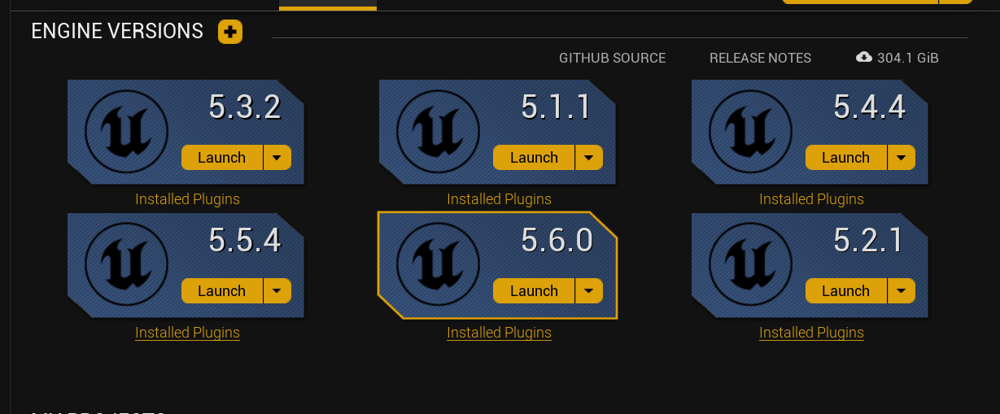

# Local CI/CD for Unreal Code Plugins 🚀

[](https://discord.com/invite/KBWmkCKv5U)
[](LICENSE)

A powerful, modular local CI/CD pipeline for building, packaging, and distributing Unreal Engine code plugins and their example projects across multiple engine versions with a single command.

This tool automates the tedious process of multi-version support, ensuring your plugin is robust and ready for distribution on marketplaces like Fab.com. It handles plugin packaging, version-specific example project generation, and optional cloud uploads.

> [!WARNING]  
> This tool is under active development.
> 1) Do not use it without version control. ⚠️
> 2) Contributions are welcome, especially for non-windows platforms.🤝

## Problem Statement 
Here is snippet from [Fab.com](https://fab.com)'s submission [guidelines](https://support.fab.com/s/article/FAB-TECHNICAL-REQUIREMENTS?language=en_US):  
> 4.3.6.2 Compilation:

> 4.3.6.2.a Code plugins must generate no errors or consequential warnings.
> 
> 4.3.6.2.b Plugins will be <code style="color : orangered">distributed with the binaries built by Epic’s compilation toolchain</code>, so publishers must ensure that final debugging has been completed by clicking "Package..." on their plugin in the Plugins windows of the editor to test compilation before sending in a new  plugin version. Publishers can also run this command from installed binary builds of each Unreal Engine version they’d like to compile their  plugin for: Engine\Build\BatchFiles\RunUAT.bat BuildPlugin -Plugin=[Path to .uplugin file, must be outside engine directory] -Package=[Output > directory] -Rocket

This basically states that, we as developers need to upload the plugin as source files and not built binaries, then epic will build the binaries for us and ship it to buyers computers. 

## Core Philosophy: Develop Low, Upgrade High

To support multiple engine versions correctly, this pipeline follows the industry-standard practice:

1. **Develop in the Oldest Version**: Your master example project (containing C++ and/or Blueprints) must be created and maintained in the oldest engine version you support (e.g., UE 5.1).

2. **Automate Upgrades**: The script automatically creates a temporary copy of your master project and uses the Unreal Engine command line to safely upgrade it for each newer version (5.2, 5.3, etc.).

This ensures that users on any supported engine version get an example project that opens and works perfectly, as Unreal Engine does not support opening assets from a newer engine version in an older one.


## Compatibility

* **Engine Versions**: This tool supports **Unreal Engine 5.1 and newer**.
* **Platform**: Currently designed for **Windows** and packages for the **Win64** platform.

## Prerequisites

<p align="center">
  
</p>

1.  **Windows & PowerShell**: Windows 10/11 with PowerShell 5.1+.
2.  **Unreal Engine**: All required engine versions must be installed via the Epic Games Launcher.
3.  **Visual Studio 2022**: You must have Visual Studio 2022 installed with the **Game development with C++** workload.
    * Under the **Individual components** tab, you must install the specific MSVC toolchains required for each engine version you intend to build for:
        * `MSVC v143 - VS 2022 C++ x64/x86 build tools (v14.32-17.2)` - **Required for UE 5.1**
        * `MSVC v143 - VS 2022 C++ x64/x86 build tools (v14.34-17.4)` - **Required for UE 5.2**
        * `MSVC v143 - VS 2022 C++ x64/x86 build tools (v14.36-17.6)` - **Required for UE 5.3**
        * `MSVC v143 - VS 2022 C++ x64/x86 build tools (v14.38-17.8)` or newer - **Required for UE 5.4+**
        * `Windows 11 SDK` or `Windows 10 SDK`
4.  **(Optional) rclone**: For the cloud upload feature, you will need to download [rclone](https://rclone.org/).

## Quick Start

### 1. Validate Your System

Before configuring, ensure your system meets all requirements:

```powershell
# Validate system prerequisites (without config file)
.\Tools\validate_config.ps1 -ConfigPath "config.example.json" -SkipEngineValidation
```

### 2. Create Your Configuration

Copy `config.example.json` to `config.json`. This file is your central control panel. All `config*.json` files (except the example) are ignored by git, so you can create multiple configurations for different projects (e.g., `config-MyPlugin.json`).

#### Main Configuration
Here is a complete example with detailed explanations below.

```json
{
  "PluginName": "YourPluginName",
  "PluginSourceDirectory": "C:/Path/To/Your/PluginSource",
  "OutputDirectory": "./Builds",
  "UnrealEngineBasePath": "C:/Program Files/Epic Games",
  "EngineVersions": [ "5.1", "5.2", "5.3", "5.4" ],

  "ExampleProject": {
    "Generate": true,
    "MasterProjectDirectory": "C:/Path/To/Your/MasterExampleProject_UE5.1",
    "GenerateCppExample": true,
    "GenerateBlueprintExample": true,
    "ExcludePluginsFromExample": [ "MyOtherPlugin" ],
    "ExcludeFolders": [
      "Content/SomeMapOrAsset/",
      "Plugins/AnotherPlugin/"
    ],
    "ExcludeFiles": [
      "Docs/",
      "*.log",
      "MySecretFile.txt"
    ]
  },

  "CloudUpload": {
    "Enable": false,
    "RcloneConfigPath": "C:/Users/YourUser/AppData/Roaming/rclone/rclone.conf",
    "RemoteName": "MyGoogleDrive",
    "RemoteFolderPath": "PluginBuilds/YourPluginName"
  },

  "BuildOptions": {
    "_comment": "Advanced options for debugging and speed.",
    "FastMode": false,
    "SkipPluginBuild": false
  }
}
```

#### Configuration Details

*   **`PluginName`**: The exact name of your plugin (without the `.uplugin` extension).
*   **`PluginSourceDirectory`**: Absolute path to your plugin's source code folder.
*   **`OutputDirectory`**: The folder where final `.zip` files will be saved.
*   **`UnrealEngineBasePath`**: Path to the directory containing all your `UE_X.X` engine installations.
*   **`EngineVersions`**: An array of engine versions you want to build for.

##### `ExampleProject` Section
This section is crucial for packaging a sample project alongside your plugin.

*   **`Generate`**: If `true`, the pipeline will generate an example project.
*   **`MasterProjectDirectory`**: The absolute path to your master example project, which must be saved in the *oldest* engine version you support.
*   **`ExcludePluginsFromExample`**: **(Important)** A list of plugin names to completely remove from the example project. This is essential if your example project contains multiple plugins (e.g., your main plugin and a companion plugin) but you only want to ship the example with one. The script will both remove the plugin's folder and disable it in the `.uproject` file.
*   **`ExcludeFolders`**: A list of folders to delete from the example project during packaging. This is useful for removing content that is not relevant to the final example, such as test maps, developer-only assets, or content related to an excluded plugin. Paths should be relative to the project root (e.g., `Content/Developer`).
*   **`ExcludeFiles`**: A list of files to delete from the example project. Supports wildcards (e.g., `*.log`).

##### `BuildOptions` Section
Advanced options for controlling the pipeline's behavior.

*   **`FastMode`**: **(Recommended)** If set to `true`, enables a highly optimized build process. It compiles the plugin and example project C++ code together in a single step, drastically reducing build times. If `false`, it uses the original, slower method of compiling the plugin separately before compiling the example project.
*   **`SkipPluginBuild`**: (Standard Mode Only) If `true`, skips the initial plugin packaging step. Useful for debugging the example project packaging in isolation.

### 2. (Optional) Configure Cloud Uploads

If you want to automatically upload your packaged files:

1. Download [rclone](https://rclone.org/). It's a single executable file; no installation is needed.
2. Run `rclone config` in a terminal.
3. Follow the interactive prompts to add a new remote (e.g., for Google Drive, Dropbox, etc.).
   * **For Google Drive**: When prompted for `client_id`, it's recommended to create your own for better performance. See [rclone's Google Drive guide](https://rclone.org/drive/#making-your-own-client-id) for step-by-step instructions.
4. Update the `CloudUpload` section in your `config.json` with the correct paths and remote name.

### 3. Validate Your Configuration

Before running the pipeline, validate your configuration:

```powershell
# Validate complete configuration
.\Tools\validate_config.ps1 -ConfigPath "config.json"

# Or run a dry-run to see what would be built
.\run_pipeline.ps1 -DryRun
```

### 4. Run the Master Pipeline

Once configured, run the master script from a PowerShell terminal in the root of the repository:

```powershell
# Full pipeline with validation
.\run_pipeline.ps1

# Use the cache to skip already-built packages
.\run_pipeline.ps1 -UseCache

# Dry run to see what would be built without executing
.\run_pipeline.ps1 -DryRun

# Run with a custom config file
.\run_pipeline.ps1 -ConfigPath "config-MyOtherPlugin.json"
```

The script will execute all configured tasks, creating plugin packages and version-specific example projects in your configured output folder (e.g., `Builds/`).

## Features

* **Modular & Config-Driven**: A master script (`run_pipeline.ps1`) orchestrates the entire process based on settings in a single `config.json` file.
* **Optimized Fast Mode**: A `FastMode` option in the config dramatically speeds up builds by compiling the plugin and example project in a single, combined step.
* **Time-Saving Cache**: Use the `-UseCache` flag to skip building any plugin or example project versions that already exist in the output directory. Perfect for iterating on a single engine version.
* **Multi-Version Plugin Packaging**: Automatically packages your source code plugin for all specified Unreal Engine versions.
* **Automated Example Project Generation**:
  * Implements a "Develop Low, Upgrade High" workflow.
  * Takes a single master example project and automatically generates upgraded, version-specific copies for all newer engines.
  * Provides powerful exclusion options (`ExcludePluginsFromExample`, `ExcludeFolders`, `ExcludeFiles`) to precisely control the contents of the final packaged example.
  * Can create both a full C++ example and a stripped, Blueprint-only version.
* **Optional Cloud Uploads**: Automatically uploads all generated `.zip` files to a cloud provider of your choice using rclone.
* **Clean & Compliant Packaging**: Creates clean, marketplace-ready zip archives, excluding all temporary files like `Binaries`, `Intermediate`, and `Saved` folders, as per marketplace guidelines.
* **Detailed Logging**: Generates separate logs for each task in a `Logs/` directory in the project root, making it easy to debug failures.
* **Automatic Cleanup**: All temporary projects and build files are deleted after each run.


## Understanding rclone (For Cloud Uploads)

New users may wonder what rclone is and how it differs from a desktop client like Google Drive for Desktop.

### What is rclone?
It's a command-line program for managing files on cloud storage. It's a single executable that you download; it does not install background services or system drivers. It only runs when our script calls it.

### How is it different from the Google Drive client?

* **Google Drive Client**: Is for synchronization. It runs constantly to make your cloud drive feel like a local disk. It is not designed for automation.
* **rclone**: Is for automation. It is a tool that scripts can call to perform a specific task (like copying a folder) and then it shuts down. This makes it perfect and safe for a CI/CD pipeline.

---

## Known Issues

> [!IMPORTANT]
> **Global Build Configuration (`BuildConfiguration.xml`)**
> To ensure the correct Visual Studio toolchain is used for each engine version, the `package_fast.ps1` script temporarily modifies the global `BuildConfiguration.xml` file located in `Documents/Unreal Engine/UnrealBuildTool`.
>
> The script creates a backup and is designed to restore it, even if the build fails. However, if the script is terminated abruptly (e.g., by a system crash or forced shutdown), the backup may not be restored. This could potentially affect other Unreal Engine projects on your system.
>
> **Mitigation**: If you suspect this has happened, you can manually restore the configuration by deleting `BuildConfiguration.xml` and renaming `BuildConfiguration.xml.bak` to `BuildConfiguration.xml` in the above directory.

## Troubleshooting

### "Banned" C++ Compiler Error: `UnrealBuildTool has banned the MSVC [version] toolchains...`

* **Cause**: Epic Games has blocked a specific compiler version due to bugs.
* **Solution**: Open the Visual Studio Installer, go to "Individual components", and install the exact MSVC version recommended in the error message.

### Zipping Fails with "Stream was too long":

* **Cause**: PowerShell's `Compress-Archive` can't handle files larger than 4GB.
* **Solution**: We recommend installing [7-Zip](https://www.7-zip.org/). You can then modify the `Compress-Archive` commands in the scripts to use the `7z.exe` command-line tool, which has no file size limits.

### Configuration Validation Fails:

* **Solution**: Run validation to see specific issues: `.\Tools\validate_config.ps1 -ConfigPath "config.json"`
* Common issues:
  - Missing Unreal Engine installations at specified paths
  - Incorrect plugin source directory path
  - Missing rclone executable (if cloud upload enabled)
  - Invalid JSON syntax in config.json

### Pipeline Fails During Build:

* **Check build logs**: Look in the `Tools/Logs/` directory for detailed error messages
* **Common causes**:
  - Plugin source has compilation errors
  - Missing Visual Studio toolchains for target engine versions
  - Insufficient disk space for temporary build files
  - Antivirus software blocking file operations

### Example Project Packaging Fails:

* **Ensure master project works**: Open the master project in UE manually first
* **Check engine association**: Master project should be developed in the oldest target engine version
* **Verify plugin compatibility**: Plugin should compile successfully for all target versions

## Contributing & Support

This project is open-source and contributions are welcome! For questions, bug reports, or feature requests, please open an issue on GitHub or contact us directly at: **mail@muddyterrain.com**

## License

This project is licensed under the MIT License - see the [LICENSE](LICENSE) file for details.
